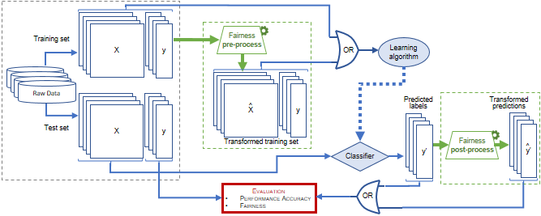

# Fairness and Bias Mitigation in ML-based Depression Prediction
Author: Vien Ngoc Dang

  

This is the implementation of the paper <b><i>Fairness and bias correction in machine learning for depression prediction: results from four different study populations</i></b> ([Dang et al., 2022](https://arxiv.org/abs/2211.05321)). In this project, we will see how to audit and address algorithmic bias. 

#### Supported bias mitigation strategies
* Suppression (SUP)
* Reweighing (RW) ([Kamiran and Calders, 2012](https://link.springer.com/article/10.1007/s10115-011-0463-8))
* Disparate Impact Remover (DIR) ([Feldman et al., 2015](https://dl.acm.org/doi/10.1145/2783258.2783311))
* Calibrated Equalized Odds Postprocessing (CPP) ([Pleiss et al., 2017](https://papers.nips.cc/paper/2017/hash/b8b9c74ac526fffbeb2d39ab038d1cd7-Abstract.html))
* Population Sensitivity-Guided Threshold Adjustment (PSTA)(our proposed post-hoc disparity mitigation method)

#### How to run the code
* ./utils and ./algorithms contain python files to implement ML models and bias mitigation algorithms
* The jypyter notebooks showed different steps to build an fair ML model associated with a *categorical* protected attribute (Notebook1) and a *continous* protected attribute (Notebook2)
