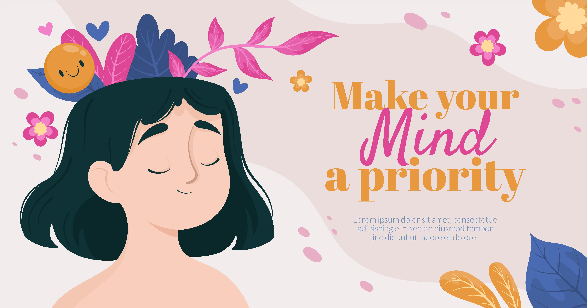

# Fairness and bias correction in machine learning for depression prediction: results from four different study populations 
Author: Vien Ngoc Dang

This is the implementation of our fair ML framework for depression prediction using exposome data in Python.
